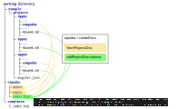

# Repodoc

Repodoc creates an app index in html for a (n angular) monorepo/multiapp project with 
- link to apps' documentation
- brief description of the apps  

Assembles docs of all apps (, if desired).

## Features

Repodoc

- finds the apps of a monorepo and their details within the angular.json of monorepo
- extracts the text of the chapter "Overview" (or another chapter) of the readme.md of each app
- copies the app's docs (if desired)
- creates an html file based on a handlebars template with a list of all apps containing
    - a link to app's docs (either copied docs or original docs)
    - app's brief description (based its readme.md, there the text of the chapter 'Project Purpose')

## Installation

    npm install repodoc -g

## Usage / CLI

### Prerequists

Repodoc works on a repository with a structure of standard angular multi projects repository. 
For building the app index Repodoc uses a template file. 

So, for getting Repodoc to run you need at least 

- a repository directory with multi projects (a projects file like angular.json and a directory 'projects' containing the projects) and 

- a handlebars template file

### Quick Start

Repodoc comes with test data

- The directory 'example' is a real angular multi project repository (unneeded directories and files has been stripped)
  The repository contains three projects: app01, app02 and app03.
  app01 and app03 have docs, but not app02.

- The directory 'template' contains a template file "index.hbs"

For the first trial copy theses two directories into the directory you will start Repodoc from.

Start repodoc just by entering

    repodoc

Commit all parameters without any change.

Repodoc will show following messages:

    using default parameters due to cannot read file repodoc.json due to ENOENT: no such file or directory, open '<working directory>\repodoc\repodoc.json'
    example\projects\app02\compodoc does not exits
    html file saved to repodoc\index.html

"using default parameters due to ..." appears the first time Repodoc runs. 
The first run creates the config file.
So, further runs find the config file and the warning will not appear anymore.

"example\projects\app02\compodoc does not exits" informs about the missing docs of app02.

The index.html contains a list of the three apps with 

- reference to their docs (only for app01 and app03 due to missing docs of app02) 
- a brief description ("purpose")
- further details (from angular.json of the repo)

### Options

By default Repodoc uses a config file named repodoc.json. 
The config file contains the parameters of Repodoc's last run. 
You can alter the name of the config file by starting Repodoc with option 
"**--configFile**=\<config file name\> resp. **-c** \<config file name\> .

By default Repodoc provides the possibility to change the parameters (--**askParams**=true is default).
With option --**askParams**=false you can skip the dialog part of the program start. Then, Repodoc uses either the config file values (if config file is available) or the default values.

By default Repodoc copies the doc's directories of the apps to the output directory where you find the generated index.html. (--**copyProjectsDocs**=true is default) 
With option --**copyProjectsDocs**=false you can omit the copying.
Then, the apps' entries gonna point to the genuine docs of the apps.

All directory, file and other parameters can be set as options. In detail:

- **repoDir**: path to mono repo, needs to be an existant directory (**default: example**)
- **projectsFile**: name of the file which contains the JSON object 'projects' (see structure of angular.json of a mono repo) (**default: angular.json**)
- **projectsDocsDir**: path to app's docs directory, needs to be an existant directory (**default: compodoc**)
- **projectsDescriptionTitle**: title of the chapter the brief description of the apps will be extracted from (**default: Overview**)
- **templatesDir**: template file(s) directory, needs to be an existant directory (**default: templates**)
- **templateFile**: template file name for creating output file, needs to be an existant file (**default: index.hbs**)
- **outputDir**: path to output directory for summarized documentation, needs to be a valid directory name, will be created if not exist (**default: repodoc**)
- **outputFile**: name of the landing page file of summarized documentation, needs to be a valid file name (**default: index.html**)

## API

Module **doc** does the work.

Module **config** handles the parameters **doc** needs.

For further informations refer to Repodoc's documentation located at **docs/html** (static html).

## References

The documentation of the sample apps is generated with [compodoc](https://compodoc.app/). The great documenation generator for Angular projects which inspired me to implement Repodoc. 

The Repodoc's documentation is generated with [TYPEDOC](https://typedoc.org/), a super got-to-the-point tool.